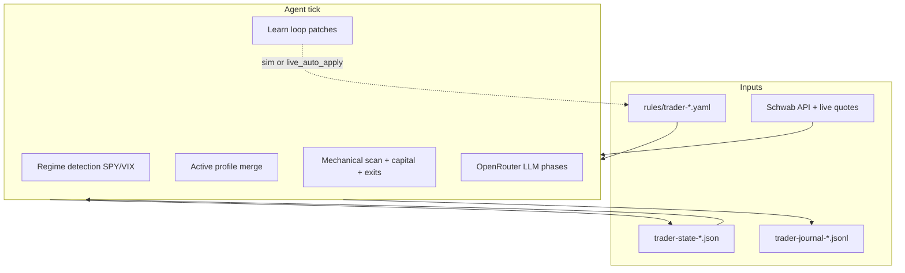
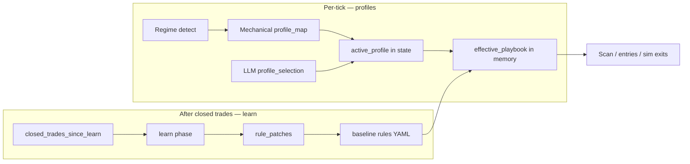
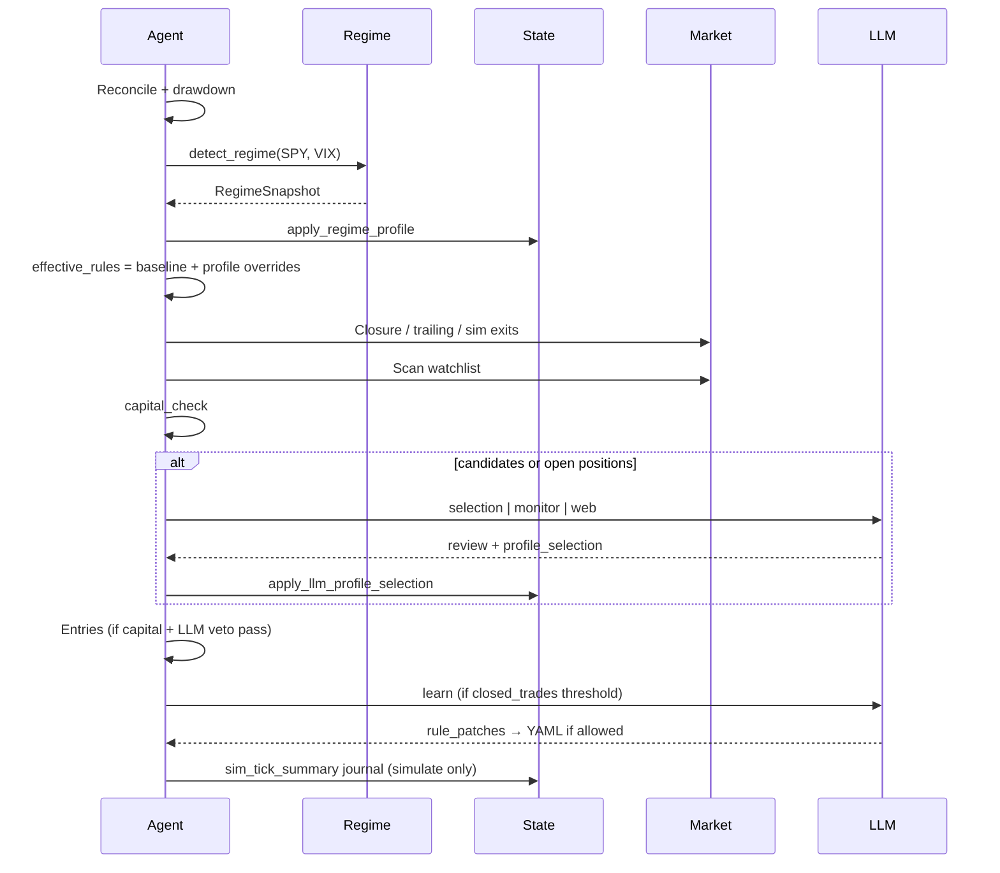
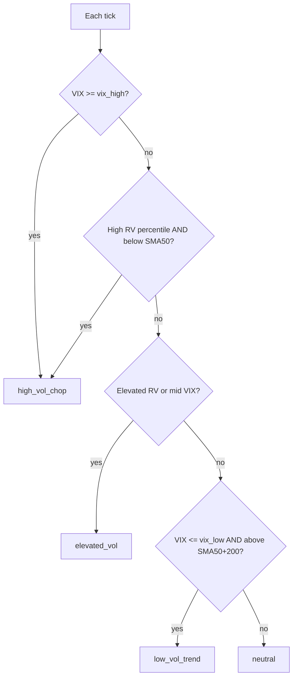
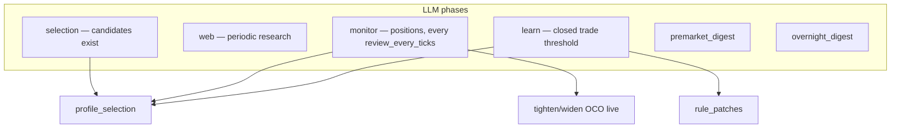
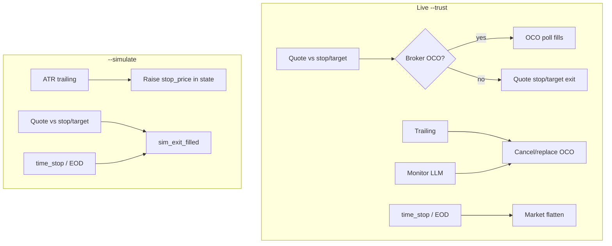
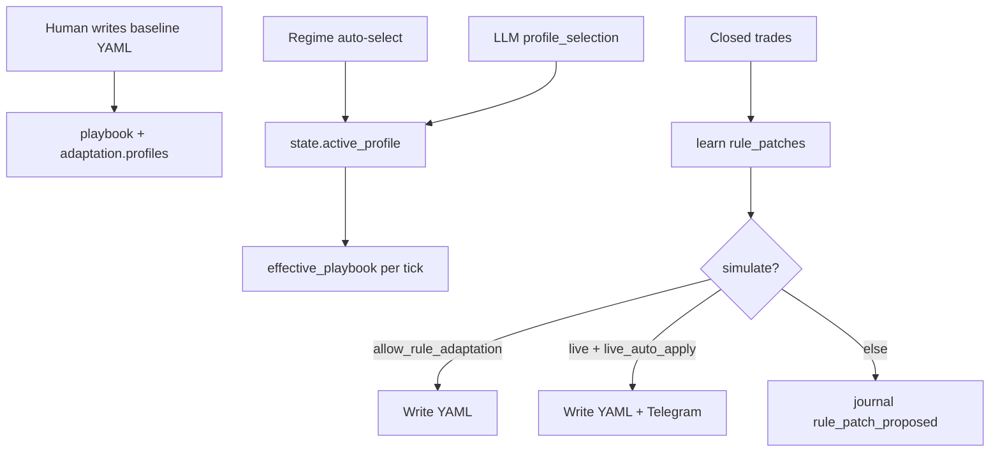

# Equity trader (`schwab-trader`)

Separate CLI for **short/medium-term equity** trading on a dedicated account sleeve.
Shares OAuth and `safety.json` with `schwab`; does **not** mix commands with the options agent.

## Architecture



| Component | Location |
|-----------|----------|
| CLI binary | `schwab-trader` (`crates/schwab-trader`) |
| Swing rules | `rules/my-trader.yaml` (copy from `trader-rules.example.yaml`) |
| Intraday rules | `rules/my-intraday-trader.yaml` (local copy) |
| Runtime state | `rules/trader-state-<rules-stem>.json` (e.g. `trader-state-my-trader.json`) |
| Journal | `rules/trader-journal-<rules-stem>.jsonl` |
| Options overlap | Reads options agent state for loss reserve (`capital.options_risk.rules_file`) |

Path stems derive from the rules **filename** (`my-trader.yaml` → stem `my-trader`).

## Locked decisions (v1)

| Topic | Choice |
|-------|--------|
| Account | Your brokerage account — copy `trader-rules.example.yaml` locally |
| Horizon | Swing (2–30 days) and intraday playbooks |
| Direction | Long default; shorts schema-only until enabled |
| Capital | Fixed sleeve cap + % of free cash after options reserve |
| Brackets | Post-fill OCO (live); quote-evaluated brackets (sim) |
| Adaptation | Regime profiles (in-memory) + learn patches (YAML baseline) |
| Web picks | Perplexity via OpenRouter (swing; disabled intraday) |
| CLI | Separate `schwab-trader` binary |

## Safety model

| Layer | Purpose |
|-------|---------|
| `safety.json` | Hard ceilings (max trade value, order types, conditional orders) |
| Rules YAML | Playbook baseline, capital sleeve, adaptation profiles |
| `capital_check` | Pre-trade budget (fixed cap + % free cash − options reserve) |
| **Profiles** | In-memory playbook overrides per tick (not written to YAML) |
| **Learn loop** | Bounded patches to baseline YAML after closed trades |
| Drawdown halt | Blocks new entries when sleeve drawdown exceeds limit |

Enable conditional orders for live OCO brackets:

```json
"allow_conditional_orders": true
```

## Adaptation system (overview)

Two complementary mechanisms:



| Mechanism | Speed | Persists | What changes |
|-----------|-------|----------|--------------|
| **Regime + profiles** | Every regular tick | State only (`active_profile`, `last_regime`) | Merged `playbook` for this tick |
| **LLM `profile_selection`** | When LLM runs | State only | Overrides mechanical profile |
| **Learn `rule_patches`** | After N closed trades | Rules YAML (sim/live per flags) | Baseline `playbook` fields |

## Regular-session tick flow



### Step reference

1. **Reconcile** — Schwab positions ↔ trader state
2. **Drawdown** — set `trading_halted_reason` if limit breached
3. **Regime** — SPY SMA 50/200, VIX, realized-vol percentile → regime class
4. **Profile** — `profile_map[regime]` → `state.active_profile` (if `regime_auto_select`)
5. **Effective playbook** — `playbook` + `adaptation.profiles[active_profile].overrides`
6. **Closure** — exits (see [Exit mechanics](#exit-mechanics))
7. **Scan** — mechanical filters on effective playbook
8. **Capital check** — sleeve budget, portfolio heat, drawdown
9. **LLM** — selection (candidates), monitor (positions), or web (research)
10. **Profile override** — LLM `profile_selection` if `llm_profile_select`
11. **Monitor OCO** — `tighten_exits` / `widen_exits` → broker OCO replace (**live only**)
12. **Entries** — limit buy → fill → OCO (live) or instant sim fill
13. **Learn** — `rule_patches` after closed-trade threshold

## Regime detection

Fetched each regular tick when `adaptation.enabled` and `adaptation.regime.enabled`.

| Signal | Source | Use |
|--------|--------|-----|
| Benchmark trend | `benchmark_symbol` (default SPY), 1y daily | SMA 50 / SMA 200 |
| Fear gauge | `vix_symbol` (default `$VIX`) | Absolute level |
| Realized vol | Benchmark closes | Annualized vol percentile vs history |

### Regime classes



| Class | Typical `profile_map` target |
|-------|---------------------------|
| `low_vol_trend` | `low_vol_trend` |
| `elevated_vol` | `elevated_vol` |
| `high_vol_chop` | `high_vol_chop` |
| `neutral` | `baseline` |

Regime output appears in tick JSON as `regime` and in state as `last_regime`.

## Schema: `adaptation`

```yaml
adaptation:
  enabled: true                    # master switch (default true if omitted)
  live_auto_apply: false           # write learn patches to YAML on live ticks
  regime_auto_select: true         # mechanical profile from regime each tick
  llm_profile_select: true         # LLM may override via profile_selection

  regime:
    enabled: true
    benchmark_symbol: SPY
    vix_symbol: $VIX
    vix_low: 15.0                  # at or below → low-vol candidate
    vix_high: 25.0                 # at or above → high-vol chop
    realized_vol_lookback: 20      # days (default)
    realized_vol_history: 60     # comparison window (default)
    realized_vol_high_percentile: 70.0

  monitor_adjustments:
    enabled: true                  # live only — OCO cancel/replace
    max_tighten_pct: 2.0           # % of entry→stop distance
    max_widen_pct: 1.5
    min_stop_distance_from_price_pct: 1.5
    max_stop_distance_from_price_pct: 8.0

  default_profile: baseline
  profile_map:
    low_vol_trend: low_vol_trend
    high_vol_chop: high_vol_chop
    elevated_vol: elevated_vol
    neutral: baseline

  profiles:                        # optional — built-ins loaded if empty
    my_custom:
      description: "Human-readable label"
      overrides:
        exit:
          profit_target_pct: 7.0
          stop_loss_pct: 4.5
          time_stop_days: 20
          trailing:
            activate_after_profit_pct: 4.0
            trail_atr_multiple: 2.25
        entry:
          rsi_14_range: [38, 65]
          max_new_entries_per_day: 0
          position_size:
            method: atr_normalized   # risk_pct | atr_normalized
            risk_per_trade_pct: 0.5
            max_position_pct: 10.0
            atr_baseline_pct: 2.0
            atr_vol_scalar_min: 0.5
            atr_vol_scalar_max: 1.5
        intraday:                    # full IntradayConfig replace if set
          min_relative_volume: 1.5
          momentum_rsi_min: 54.0
          require_above_sma: [9, 20]
```

### Built-in profiles

Loaded automatically when `adaptation.profiles` is empty (`normalize_adaptation` on rules load).

| Profile | Behavior summary |
|---------|------------------|
| `baseline` | No overrides — use `playbook` section as-is |
| `low_vol_trend` | Wider target, tighter stop, higher size, normal entries |
| `elevated_vol` | Moderate brackets, `atr_normalized` sizing, 1 entry/day |
| `high_vol_chop` | Wider stop, **0 new entries/day**, defensive `atr_normalized` size |

## Schema: `llm`

```yaml
llm:
  enabled: true
  selection_model: google/gemini-2.5-flash
  monitor_model: google/gemini-2.5-flash
  web_model: perplexity/sonar
  learn_model: google/gemini-2.5-flash
  review_every_ticks: 3            # monitor cadence (regular ticks)
  web_research_every_reviews: 2
  learn_every_ticks: 6
  learn_min_closed_trades: 3
  max_tokens: 2500
  veto_entries: true               # require LLM proceed for entries (live)
  allow_llm_exits: false           # prompt only — NOT wired to execution
  allow_rule_adaptation: true      # enable learn phase

  adaptation_bounds:               # clamps for rule_patches
    profit_target_pct: { min: 5.0, max: 12.0, max_delta_per_change: 1.0 }
    stop_loss_pct: { min: 2.5, max: 6.0, max_delta_per_change: 0.5 }
    trail_atr_multiple: { min: 1.5, max: 3.0, max_delta_per_change: 0.25 }
    activate_after_profit_pct: { min: 3.0, max: 8.0, max_delta_per_change: 0.5 }
    risk_per_trade_pct: { min: 0.3, max: 1.2, max_delta_per_change: 0.15 }
    max_new_entries_per_day: { min: 0, max: 2, max_delta_per_change: 1 }
    time_stop_days: { min: 5, max: 45, max_delta_per_change: 5 }
    time_stop_minutes: { min: 15, max: 120, max_delta_per_change: 15 }
    min_relative_volume: { min: 0.8, max: 2.0, max_delta_per_change: 0.2 }
    momentum_rsi_min: { min: 48.0, max: 60.0, max_delta_per_change: 2.0 }
    rsi_14_range: { min_low: 30, max_low: 45, min_high: 60, max_high: 75 }

  immutable_fields:                # learn loop skips these paths
    - capital.fixed_sleeve_cap_usd
    - capital.max_pct_of_free_cash
    - playbook.direction
    - accounts

  prompts:
    selection: "..."
    selection_web: "..."
    monitor: "..."
    learn: "..."
```

### LLM response schema (all phases)

Every review returns JSON including:

| Field | Purpose |
|-------|---------|
| `market_commentary` | Narrative |
| `candidates[]` | Per-symbol `proceed\|defer\|skip` (selection) |
| `positions[]` | `hold\|watch\|tighten_exits\|widen_exits` (monitor) |
| `new_entries` | Global entry gate |
| `profile_selection` | `{ profile, reasoning }` — must match `adaptation.profiles` keys |
| `rule_patches[]` | Learn only: `{ path, value, reason }` |



### Learn loop triggers

Runs when `llm.enabled` and `llm.allow_rule_adaptation`, and either:

- `closed_trades_since_learn >= learn_min_closed_trades`, or
- `learn_every_ticks` elapsed with `closed_trades_since_learn > 0`

### Learn-adaptable paths (`rule_patches`)

| Path | Type |
|------|------|
| `playbook.exit.profit_target_pct` | float |
| `playbook.exit.stop_loss_pct` | float |
| `playbook.exit.trailing.trail_atr_multiple` | float |
| `playbook.exit.trailing.activate_after_profit_pct` | float |
| `playbook.exit.time_stop_days` | int (swing) |
| `playbook.exit.time_stop_minutes` | int (intraday) |
| `playbook.entry.rsi_14_range` | `[low, high]` |
| `playbook.entry.position_size.risk_per_trade_pct` | float |
| `playbook.entry.position_size.method` | `risk_pct` \| `atr_normalized` |
| `playbook.entry.max_new_entries_per_day` | int |
| `playbook.intraday.min_relative_volume` | float |
| `playbook.intraday.momentum_rsi_min` | float |

Patches are validated, clamped via `adaptation_bounds`, then applied per [governance](#llm-governance).

## Schema: `playbook.entry.position_size`

```yaml
position_size:
  method: risk_pct              # risk_pct | atr_normalized
  risk_per_trade_pct: 0.75      # % of fixed_sleeve_cap_usd risk budget
  max_position_pct: 15.0        # % of sleeve cap max position value
  atr_baseline_pct: 2.0           # reference ATR% for atr_normalized
  atr_vol_scalar_min: 0.5         # floor vol scaler
  atr_vol_scalar_max: 1.5         # cap vol scaler
```

**`atr_normalized`:** `risk_budget *= clamp(baseline_atr_pct / current_atr_pct, min, max)` so high vol → smaller positions.

## Schema: `simulation`

```yaml
simulation:
  starting_cash_usd: 4000
  allow_rule_adaptation: true     # learn may write YAML in --simulate
```

## Exit mechanics



| Exit reason | Live | Sim |
|-------------|------|-----|
| `stop_loss` | Broker OCO or quote if unbracketed | Quote ≤ `stop_price` |
| `profit_target` | Broker OCO or quote if unbracketed | Quote ≥ `profit_limit` |
| Trailing | OCO stop raised via API | `stop_price` raised in state (`sim_trailing_stop_updated`) |
| `time_stop` | Manual flatten | Quote at last |
| `eod_flatten` / `overnight_flatten` | Manual flatten | Quote at last |
| LLM discretionary sell | **Not implemented** (`allow_llm_exits` prompt-only) | N/A |

Sim positions use `oco_order_id: null` so brackets are always evaluated from live quotes (mirrors real bracket behavior without a broker OCO).

## Runtime modes

| Mode | Flag | Orders | Exits | Learn YAML write |
|------|------|--------|-------|------------------|
| **Dry-run** | `--dry-run` | None | Preview only | Journal `rule_patch_proposed` only |
| **Simulation** | `--simulate` | Instant paper fill | Live quotes | Yes if `simulation.allow_rule_adaptation` |
| **Live** | `--trust --yes` | Real Schwab | Broker OCO + flatten | Only if `adaptation.live_auto_apply` |

`--dry-run` and `--simulate` are mutually exclusive.

## Runtime state (`trader-state-*.json`)

Adaptation-relevant fields:

| Field | Description |
|-------|-------------|
| `active_profile` | Current profile name (e.g. `elevated_vol`) |
| `active_profile_source` | `regime` or `llm` |
| `active_profile_reason` | Human-readable why |
| `last_regime` | Last `RegimeSnapshot` JSON |
| `closed_trades_since_learn` | Counter for learn phase |
| `last_learn_tick` | Tick index of last learn run |
| `sim` | Paper ledger (`closed_trades`, `equity_snapshots`) |

## Tick JSON (regular session)

Key fields appended by the agent:

| Field | Description |
|-------|-------------|
| `regime` | Full regime snapshot |
| `active_profile` | Profile name after regime + LLM |
| `active_profile_source` | `regime` \| `llm` |
| `effective_playbook` | Merged exit/entry params used this tick |
| `llm_phase` | `selection` \| `monitor` \| `web` \| null |
| `monitor_adjustments` | Live OCO adjustments this tick |
| `closure_exits` | Exits triggered this tick |
| `learn` | Learn phase result |
| `sim_stats` | Ledger stats when sim ledger exists |

## Journal (`trader-journal-*.jsonl`)

One JSON object per line: `{ "ts", "type", "payload" }`.

### Event catalog

| Type | When | Key payload fields |
|------|------|-------------------|
| `sim_tick_summary` | Every `--simulate` regular tick | Full tick mirror (regime, profile, scan, entries, exits, LLM) |
| `sim_entry_filled` | Sim buy | symbol, quantity, fill_price, stop_price, profit_limit, sizing, profile, regime |
| `sim_exit_filled` | Sim close | exit_reason, pnl_usd, pnl_pct, hold_days/minutes, brackets |
| `sim_trailing_stop_updated` | Sim trailing tighten | old/new stop, profit_pct |
| `profile_changed` | Profile transition | from, to, source, reason, regime |
| `entry_filled` | Live buy fill | symbol, quantity, order_id |
| `exit_filled` | Live manual exit | exit_reason, fill_price |
| `trailing_stop_updated` | Live trailing OCO replace | new_stop |
| `monitor_exit_adjusted` | Live monitor OCO adjust | tighten/widen, new_stop |
| `rule_auto_applied` | Learn patch written | patches, applied |
| `rule_patch_proposed` | Learn patch rejected/blocked | patches |
| `entry_signal` | Entry attempt started | source, capital_check |

### Simulation analysis commands

```bash
# Quick ROI + exit reason breakdown
schwab-trader sim stats --rules-file rules/my-trader.yaml --json

# Full report: ledger + journal + adaptations + equity curve
schwab-trader sim report --rules-file rules/my-trader.yaml --json

# Export for offline analysis
schwab-trader sim report --rules-file rules/my-trader.yaml \
  --output rules/sim-week-report.json

# Journal event counts
schwab-trader journal stats --rules-file rules/my-trader.yaml --json
```

`sim report` includes: `ledger_stats`, `closed_trades_ledger`, `equity_curve`, `trade_journal`, `profile_timeline`, `regime_timeline`, `adaptations`, `event_counts`.

## Agent tick schedule

| Session | When | Sleep | LLM | Trades |
|---------|------|-------|-----|--------|
| **regular** | 9:30–16:00 ET | `tick_interval_seconds` (90s) | Selection when candidates; monitor every `review_every_ticks` | Yes |
| **premarket** | 8:00–9:30 ET | `premarket_tick_interval_seconds` | Web digest only | No |
| **overnight** | Closed + `overnight.enabled` | `overnight.tick_interval_seconds` | Web digest if not flat | No |
| **idle** | Closed, overnight off | 3600s | None | No |

All wall-clock times use **`America/New_York`**. Rules validation rejects other `schedule.timezone` values.

`regular_tick_count` tracks only regular-session ticks (monitor cadence is not skewed by premarket/overnight).

## Playbook styles

| Style | Rules file | Holds | Closure |
|-------|------------|-------|---------|
| **Swing** | `my-trader.yaml` | 2–30 days | Optional overnight |
| **Intraday** | `my-intraday-trader.yaml` | Same session | Flatten by 15:55 ET; no entries after 15:30 ET |

Intraday uses minute-bar analytics (relative volume, SMA 9/20) and `time_stop_minutes`. OCO duration should be `DAY`, not `GTC`.

## Capital formula (every entry)

```
options_reserved = options_agent_state.reserved_risk_usd() × (1 + buffer_pct/100)
free_cash        = max(0, cash_available − options_reserved − min_cash_floor)
pct_budget       = free_cash × max_pct_of_free_cash / 100
cap_remaining    = fixed_sleeve_cap_usd − equity_deployed (trader positions only)
tradable_budget  = min(pct_budget, cap_remaining)
```

`schwab-trader capital show --rules-file <path> --json` prints the full ledger.

## Bracket execution (live)

1. Limit buy → wait for fill
2. Place OCO: limit sell (profit) + stop-limit sell (stop)
3. Trailing: cancel/replace OCO when profit threshold + ATR trail met
4. Monitor LLM `tighten_exits` / `widen_exits`: bounded OCO stop adjust

## LLM governance



| Actor | Can change | Persists |
|-------|------------|----------|
| Human | Everything in YAML | Git / disk |
| Regime engine | `active_profile` | State file |
| LLM `profile_selection` | `active_profile` | State file |
| LLM `rule_patches` | Baseline `playbook` fields (table above) | YAML if sim/live flags allow |
| LLM `tighten/widen_exits` | OCO stop distance | Broker order (live) |

**Immutable by learn loop:** paths in `llm.immutable_fields` (capital caps, direction, accounts, etc.).

## Data sources (`sources.feeds`)

Configure URLs, JSON APIs, and RSS feeds. Prefetched before LLM calls as `source_feeds`.

| Field | Description |
|-------|-------------|
| `id` | Unique key; cite in reasoning |
| `kind` | `url` \| `api` \| `rss` |
| `phases` | `selection`, `web`, `monitor`, `learn`, digests, or `all` |
| `auth.token_env` | Secret from environment (never in YAML) |

```bash
schwab-trader sources list --rules-file rules/my-trader.yaml --json
schwab-trader sources test --rules-file rules/my-trader.yaml --json
```

## Quick start

```bash
schwab auth login
schwab-trader rules validate rules/my-trader.yaml --json
schwab-trader capital show --rules-file rules/my-trader.yaml --json

# Dry-run one tick
schwab-trader agent run rules/my-trader.yaml --dry-run --once --json

# Paper trading week
schwab-trader watch --rules-file rules/my-trader.yaml --simulate
schwab-trader sim report --rules-file rules/my-trader.yaml --json

# Live (requires disclaimer + --trust --yes)
schwab disclaimer accept --yes
schwab-trader watch --rules-file rules/my-trader.yaml --trust --yes
```

## Implementation map

| Concern | Rust module |
|---------|-------------|
| Regime detection | `regime.rs` |
| Profile merge + monitor OCO | `adaptation.rs` |
| Learn patches | `learn.rs` |
| Sim exits + trailing | `sim.rs` |
| Live exits + OCO | `closure.rs`, `orders.rs` |
| Agent orchestration | `agent/runner.rs` |
| LLM client | `agent/llm.rs` |
| Journal + sim report | `journal.rs` |
| Rules schema | `rules.rs` |

## v1 scope

- [x] Regime-aware profiles + effective playbook
- [x] LLM `profile_selection` + expanded learn actuators
- [x] Realistic sim exits (stop/target/trailing from live quotes)
- [x] `sim report` + per-tick journal logging
- [x] Monitor OCO adjust (live)
- [x] Intraday playbook (local `my-intraday-trader.yaml`)
- [ ] `allow_llm_exits` execution (prompt/schema only today)
- [ ] Full watch TUI polish
- [ ] Short selling in production (schema only)

## Related

- [TRADER_ROLLOUT.md](TRADER_ROLLOUT.md) — live deployment checklist
- [OPTIONS_RULES.md](OPTIONS_RULES.md) — options agent on same account
